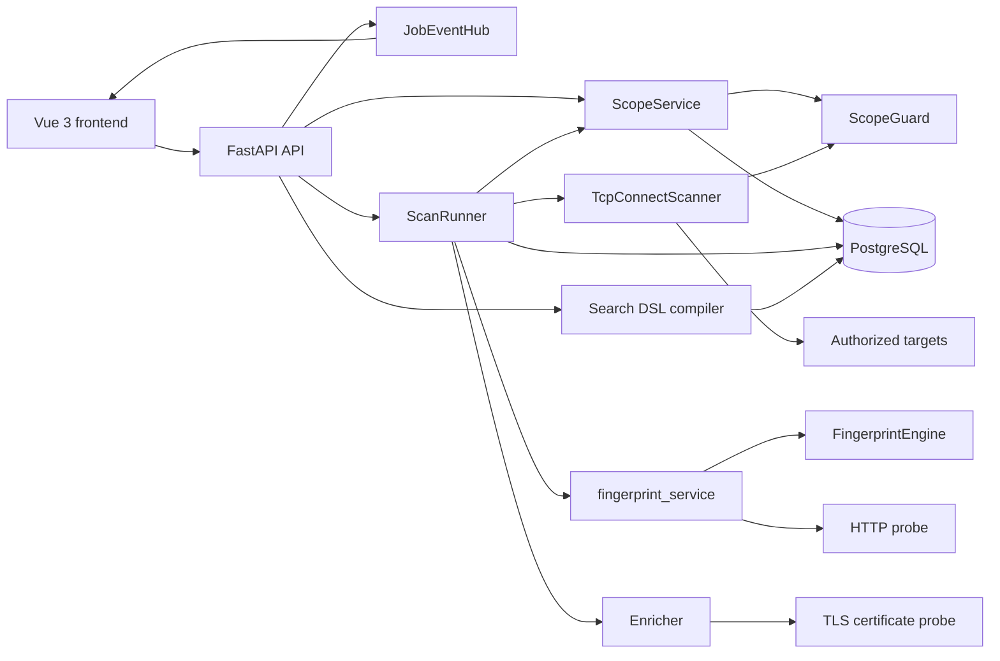
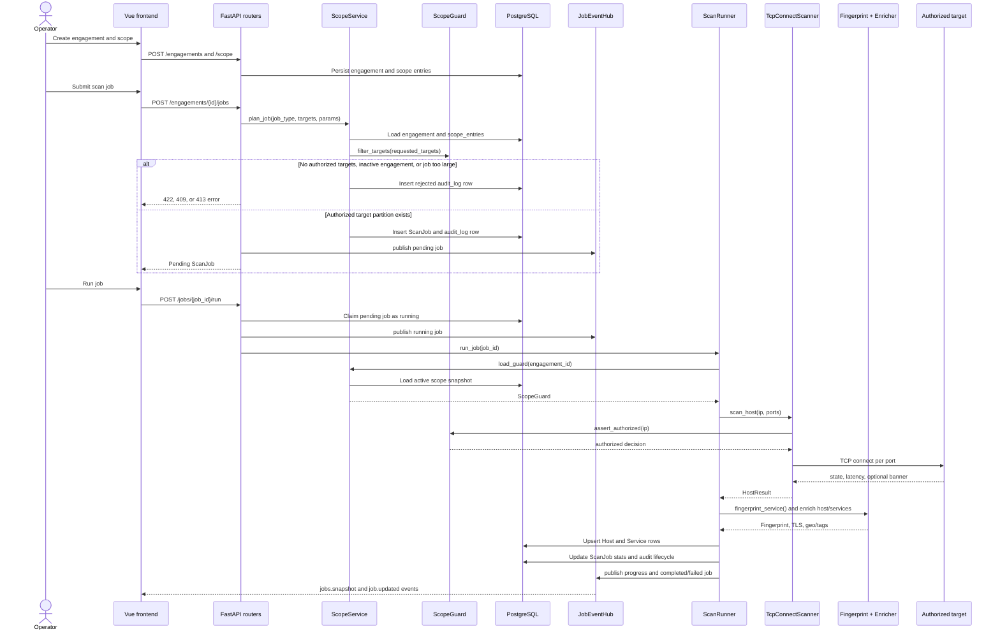
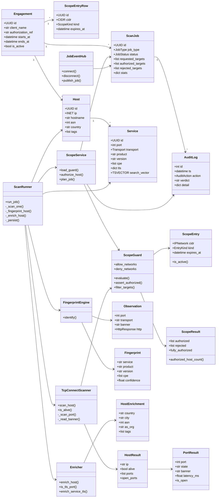

# ReconHive

ReconHive is an authorized network reconnaissance and search platform for
pentest engagements, internal asset discovery, and lab environments. It combines
engagement scope management, a hard pre-packet authorization gate, async TCP
connect scanning, service fingerprinting, enrichment, searchable PostgreSQL
storage, and a Vue 3 operator UI.

> ReconHive is for pentest engagements with written client authorization,
> internal asset discovery, and lab use. The Scope Guard is the central
> design element precisely because unauthorized internet-wide scanning is
> illegal in most jurisdictions. Every scan passes through it.

The main design goal is defense in depth: requested targets are filtered before
a job is queued, and each host is checked again immediately before the scanner
opens a socket. The audit log records scope decisions and job lifecycle events
so each engagement has a reviewable compliance trail.

## Architecture

ReconHive is a small modular application:

- **Frontend:** Vue 3 + Vite operator console for engagements, scope, jobs,
  live progress, hosts, search, and audit.
- **API:** FastAPI routers expose engagement/scope, scan jobs, search, hosts,
  audit, and WebSocket job updates.
- **Scope layer:** `ScopeService` loads persisted authorization rules and
  delegates CIDR math to the pure `ScopeGuard`.
- **Scan layer:** `ScanRunner` executes queued jobs through `TcpConnectScanner`,
  bounded concurrency, rate limiting, fingerprinting, enrichment, and upserts.
- **Persistence:** PostgreSQL stores engagement-scoped scope rules, jobs, hosts,
  services, search vectors, JSONB enrichment, and append-only audit records.



## System Flow

1. An operator creates an engagement with a signed authorization reference and
   an active time window.
2. The operator adds allow and deny CIDR scope entries. Deny rules always
   override allow rules.
3. The operator submits a scan job. `ScopeService.plan_job()` loads the current
   engagement scope, partitions requested targets into authorized and rejected
   CIDR blocks, applies the configured host-count cap, persists the pending job,
   and writes an audit record.
4. The operator runs the job. The API atomically claims a pending job, records
   `job_started`, and either runs inline (`wait=true`) or schedules a FastAPI
   background task.
5. `ScanRunner` loads a fresh `ScopeGuard`, expands authorized CIDRs into hosts,
   and scans hosts through `TcpConnectScanner`.
6. `TcpConnectScanner.scan_host()` calls `ScopeGuard.assert_authorized()` before
   any network I/O. If a host is not authorized, no socket is opened.
7. Open ports are fingerprinted from banners and targeted HTTP probes, enriched
   with host classification, optional GeoIP, and TLS certificate metadata, then
   upserted into `hosts` and `services`.
8. Job progress and terminal status are committed and published through
   `JobEventHub` to WebSocket clients.
9. Operators use host listing, host detail, the scoped search DSL, and the audit
   endpoint to review results.

## Scan Sequence



## Main Class Diagram



## Compact Architecture Sketch

```
                        +---------------------+
   requested targets -> |     ScopeService    | -- audit_log -->  PostgreSQL
                        |  +--------------+    |
                        |  |  ScopeGuard  |    |   pure CIDR arithmetic,
                        |  +--------------+    |   no I/O, fully unit-tested
                        +----------+----------+
                                   | authorized targets only
                                   v
                         ScanJob -> ScanRunner -> TcpConnectScanner
                                   |
                                   v
                        hosts -+- services (tsvector + JSONB)
                               +- enrichment (netclass / geoip / tls)
                                   |
                                   v
                  FastAPI search API -- query DSL -> SQL -- Vue 3 frontend
```

## What Is Implemented

The safety foundation, scan execution path, search surface, and operator UI are
implemented as a vertical slice.

| File | Purpose |
|------|---------|
| `app/scope/guard.py` | **Pure** Scope Guard. CIDR set arithmetic: allow/deny, deny-overrides-allow, partial-coverage partitioning, expiry. No DB/network deps. |
| `app/scope/exceptions.py` | `OutOfScopeError` (the hard gate), `InvalidTargetError`. |
| `app/scope/service.py` | DB-backed bridge: loads a guard from an engagement, audits every decision, plans jobs (authorized vs rejected partition + per-job host cap). |
| `app/db/models.py` | `engagements`, `scope_entries` (native `CIDR`), `hosts`/`services` (`INET`, `JSONB`, `tsvector`), `scan_jobs`, append-only `audit_log`. |
| `app/db/base.py` | Declarative base + Alembic-friendly naming convention. |
| `app/db/session.py` | Async engine + session factory + FastAPI dependency. |
| `app/config.py` | Env-driven settings, incl. `max_authorized_hosts_per_job` safety cap. |
| `app/api/` | FastAPI app factory, routers, Pydantic schemas, dependencies, and in-process WebSocket job fan-out. |
| `app/scan/runner.py` | Job runner: claims/runs jobs, expands authorized targets, tracks progress, fingerprints/enriches, persists results, and audits lifecycle. |
| `app/scan/scanner.py` | Async TCP connect scanner. Enforces `ScopeGuard.assert_authorized()` before any socket is opened. |
| `app/fingerprint/` | Service fingerprint engine, curated signatures, and HTTP(S) probing for request-first services. |
| `app/enrich/` | Host network classification, optional GeoIP integration, and TLS certificate enrichment. |
| `app/search/` | Query DSL lexer/parser/compiler that produces scoped, parameterized SQLAlchemy queries. |
| `frontend/src/` | Vue 3 UI for search, hosts, jobs/progress, engagements/scope, and audit. |
| `tests/` | Unit and integration coverage for scope, scanner, fingerprinting, enrichment, search, API flow, and job events. |

### Authorization model

A target host `T` is in scope **iff** it is covered by an active `allow`
block **and** not covered by any active `deny` block. `deny` always wins —
this mirrors how SOWs are written ("scan 10.0.0.0/16 *except* 10.0.5.0/24").

Two entry points:
- `ScopeGuard.assert_authorized(ip)` — the per-host gate the worker calls
  immediately before sending any packet. Raises `OutOfScopeError`.
- `ScopeService.plan_job(...)` — submission-time planner that partitions a
  requested target spec into authorized networks and the rejected remainder,
  persists a `ScanJob`, and writes the audit trail.

## Run the tests

```bash
pip install -e ".[dev]"
pytest -q
```

## Local database

```bash
docker compose up -d db
```

```bash
# backend
pip install -r requirements.txt && ./run_api.sh
# frontend
cd frontend && npm install && npm run dev   # http://localhost:5173
```

## GeoIP / ASN enrichment

ReconHive can enrich globally routable hosts with MaxMind GeoLite2 City and ASN
data. The app reads binary `.mmdb` paths from:

```bash
RECONHIVE_GEOIP_CITY_DB=data/geoip/GeoLite2-City.mmdb
RECONHIVE_GEOIP_ASN_DB=data/geoip/GeoLite2-ASN.mmdb
```

Download/update the local databases with your MaxMind account credentials:

```bash
export RECONHIVE_MAXMIND_ACCOUNT_ID=your_account_id
export RECONHIVE_MAXMIND_LICENSE_KEY=your_license_key
scripts/download_geoip_dbs.sh
```

For Docker Compose, the same host directory is mounted into the API container at
`/geoip`, and compose sets the container paths automatically.
